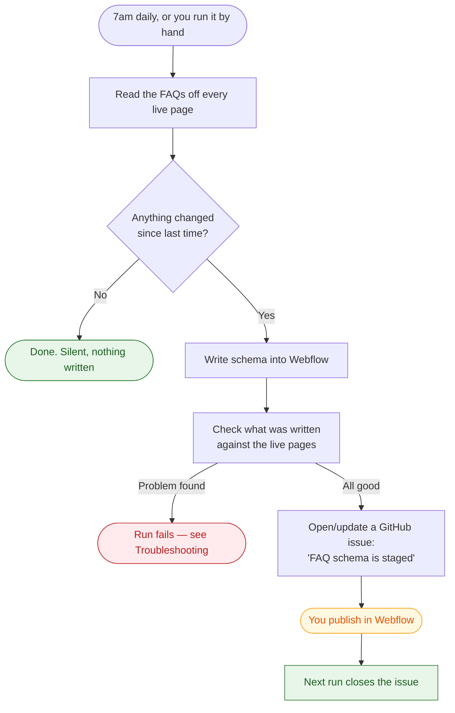

# FAQ schema — how to run it

## What this does

Every FAQ on prompthealth.com should also exist in a machine-readable form (`FAQPage` JSON-LD)
so AI answer engines — ChatGPT, Claude, Perplexity, Copilot — can read our answers directly.
This job reads the FAQs off the live pages every morning, writes matching schema into Webflow,
and tells us when there's something to publish. Nobody has to write or maintain schema by hand.

**It never publishes.** It writes schema into Webflow and waits for a person to hit Publish.

---

## The daily flow



A normal day is silent: no FAQ edits means nothing written, nothing committed, no issue.

---

## Running it yourself

All in the browser — no terminal, nothing to install.

1. Go to the repo's **Actions** tab
2. Pick **FAQ schema sync** in the left sidebar
3. Click **Run workflow** (top right)
4. Set the options, then **Run workflow** again

| Option | What it means |
|---|---|
| **Write to Webflow** | Off = preview only, changes nothing. On = actually writes schema. |
| **Allow the gated publish** | Leave **off**. Publishing is done from Webflow. |
| **Restrict to these paths** | Leave blank for all pages. Or e.g. `/demo,/products/kiosk` to limit it. |

**The two things you'll actually do:**

- **See what would change** → everything off. Safe, writes nothing.
- **Push schema to Webflow** → *Write to Webflow* on. Then publish in Webflow.

Click the run to watch it; the summary at the bottom shows every page and what happened.

> Running a workflow needs write access to this repo. If you don't see the **Run workflow**
> button, ask to be added as a collaborator.

---

## Publishing

Schema written by this job sits in Webflow **unpublished** until someone publishes the site.

⚠️ **A full-site publish also ships anything else staged in the Designer.** Publish when you're
happy for all pending work to go live, not just the schema.

After publishing, the next run closes the GitHub issue automatically.

---

## Reading the output

```
34 FAQ pages, 235 Q&As published, 1 changed

  CHANGED  /faq                        q=26  bare
    ok     /products/kiosk             q=5   graph
```

| | Meaning |
|---|---|
| `CHANGED` | This page's schema is being written |
| `ok` | Already correct, skipped |
| `q=26` | How many questions went into the schema |
| `bare` | The page has only FAQ schema |
| `graph` | FAQ schema sits alongside hand-written schema, both preserved |

Message prefixes:

| Prefix | Meaning | Needs action? |
|---|---|---|
| `NOTE` | Informational | No |
| `VALID` | Passed the schema.org validator | No |
| `SKIP` | Page deliberately left alone (noindex, or a conflict) | Sometimes — read it |
| `DUPE` | Repeated headings dropped (see `/compare/*` below) | No |
| `TODO` | Page has FAQs but not the required markup | Yes, in Webflow |
| `WARN` | Something odd but not blocking | Read it |
| `FATAL` | Stopped without writing anything | Yes |
| `REFUSING` | Wrote schema but declined to publish | No, publish yourself |

---

## The markup contract

If you edit the FAQ component in Webflow, **keep these attributes** — the job finds FAQs by them.

| Attribute | Goes on |
|---|---|
| `data-faq-item` | The wrapper around one question + answer |
| `data-faq-question` | The question text |
| `data-faq-answer` | The answer rich text |
| `data-faq-list` | The list wrapper (optional) |

For a page holding its FAQ in **one rich-text field** (like `/faq`, which needs it that way for
the Finsweet table of contents):

| Attribute | Goes on |
|---|---|
| `data-faq-richtext-list` | The rich-text block |
| `data-faq-richtext-heading` | Optional — which heading is a question (default `h3`) |

The job **hard-fails** rather than quietly wiping schema if these disappear from a page that had
them. That's deliberate.

---

## Troubleshooting

**`FATAL: FAQ attributes missing but legacy accordion markup still present`**
The FAQ component lost its `data-faq-*` attributes. Nothing was written. Restore them in Webflow.

**`SKIP: has [data-faq-richtext-list] but no questions parsed from it`**
The attribute is on the wrong block, or the questions aren't `<h3>`. Fix in Webflow, or set
`data-faq-richtext-heading`.

**`SKIP: existing schema already embeds an FAQPage`**
That page's hand-written schema already contains FAQ schema. Adding ours would give the page two
contradicting FAQ blocks, so it's skipped. Remove the nested one in Webflow (Page settings →
JSON-LD) and it syncs normally.

**`REFUSING TO PUBLISH the whole site`**
Expected. Someone has unpublished Designer work, so it won't force a publish. Schema is staged —
publish from Webflow when ready.

**`DUPE: dropped N item(s) under a repeated heading`**
Expected on `/compare/*`. Those pages reuse the FAQ component for "Ask \<Competitor\>" blocks,
which aren't questions. They're dropped rather than published as nonsense Q&As.

**Verification failed**
The check comparing what was written against the live pages found a mismatch. Don't publish;
open an issue with a link to the run.

---

## Who to ask

Open an issue in this repo with a link to the failing run. `README.md` has the technical detail.
