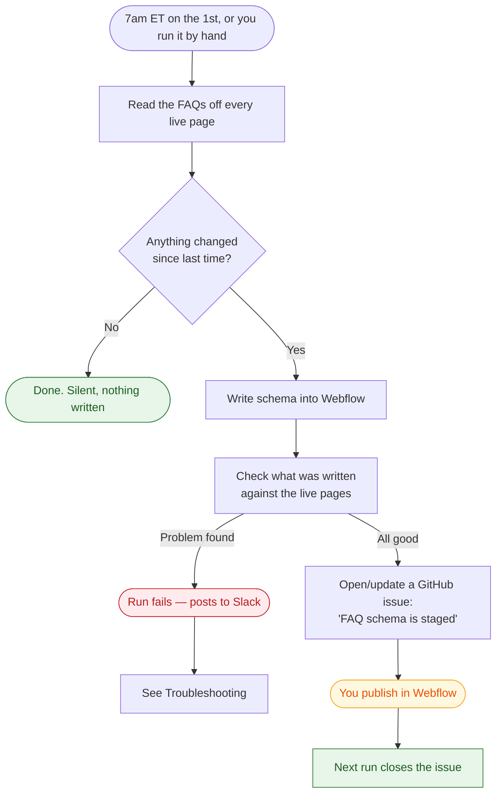

# FAQ schema — how to run it

## What this does

Every FAQ on prompthealth.com should also exist in a machine-readable form (`FAQPage` JSON-LD)
so AI answer engines — ChatGPT, Claude, Perplexity, Copilot — can read our answers directly.
This job reads the FAQs off the live pages every morning, writes matching schema into Webflow,
and tells us when there's something to publish. Nobody has to write or maintain schema by hand.

**It never publishes.** It writes schema into Webflow and waits for a person to hit Publish.

---

## The monthly flow



A normal run is silent: no FAQ edits means nothing written, nothing committed, no issue. **If a run
fails, it posts to Slack** — you don't have to watch the Actions tab.

⚠️ **The job only runs once a month.** Nothing you change in Webflow reaches the schema until the
next 1st — or until you run it by hand, below.

---

## Running it yourself

All in the browser — no terminal, nothing to install.

1. Go to the repo's **Actions** tab
2. Pick **FAQ schema sync** in the left sidebar
3. Click **Run workflow** (top right)
4. Set the options, then **Run workflow** again

| Option | What it means |
|---|---|
| **Write to Webflow** | Off = preview only, changes nothing. On = actually writes schema. |
| **Allow the gated publish** | Leave **off**. Publishing is done from Webflow. |
| **Restrict to these paths** | Leave blank for all pages. Or e.g. `/demo,/products/kiosk` to limit it. |
| **Which site to read from** | `production` normally. `staging` previews your Webflow changes before you publish — it **never writes**, whatever the other boxes say. |

**The two things you'll actually do:**

- **See what would change** → everything off. Safe, writes nothing.
- **Push schema to Webflow** → *Write to Webflow* on. Then publish in Webflow.

**Just published a blog post with FAQs?** Its schema won't be live until the next monthly run.
Run the job by hand with *Write to Webflow* on and it ships straight away — blog posts publish
per item, so there's nothing to publish afterwards in Webflow.

Click the run to watch it; the summary at the bottom shows every page and what happened.

> Running a workflow needs write access to this repo. If you don't see the **Run workflow**
> button, ask to be added as a collaborator.

---

## Blog posts and other CMS pages

Blog posts work differently from normal pages, because a whole collection shares one template —
writing schema there would put identical FAQs on every post. Instead each post stores its own
schema in a CMS field (`faq-schema-embed`) that an HTML Embed element on the template outputs.

Two things follow:

- **Blog schema publishes itself.** CMS items publish individually, so the job ships only the
  posts it touched. No full-site publish, nothing else riding along — the manual publish step
  below does not apply to blog posts.
- **A post needs FAQ markup to be picked up.** Add the FAQ block to the post as usual; the job
  finds it on the next run. Nothing to configure per post.

Don't edit the `faq-schema-embed` field by hand — the job overwrites it. Your FAQ content lives
in the `FAQs` field, which the job only ever reads.

### Only Blog posts is scanned

Unlike normal pages, CMS collections are **not** auto-discovered. **Blog posts** is the only
collection the job looks at. Adding FAQs to an item in any other collection — Glossary, Customers,
anything new — does nothing, and the run won't warn you, because the job never looks there.

Adding a collection is a small job, but it is not self-serve. It needs someone with Designer
access and someone who can change the code:

1. **In Webflow** — add a multi-line Plain Text field for the schema, put an HTML Embed on that
   collection's template with the field bound inside a `<script type="application/ld+json">` tag,
   set the embed's conditional visibility so it only shows when the field isn't empty, give it the
   `data-richtext-schema` attribute, and add the FAQ attributes to the template.
2. **In this repo** — one entry in `CMS_COLLECTIONS` in `sync.py` naming the collection, the
   field, and the URL prefix.

Full details, including why it has to be an HTML Embed rather than the page's SEO settings, are in
[README.md](README.md#cms-collections). If you want a collection added, open an issue on this repo
saying which one — don't add the field on your own, since the two halves have to match.

## Publishing

Schema written by this job sits in Webflow **unpublished** until someone publishes the site.

⚠️ **A full-site publish also ships anything else staged in the Designer.** Publish when you're
happy for all pending work to go live, not just the schema.

After publishing, the next run closes the GitHub issue automatically.

---

## Reading the output

```
34 FAQ pages, 235 Q&As published, 1 changed

  CHANGED  /faq                        q=26  bare
    ok     /products/kiosk             q=5   graph
```

| | Meaning |
|---|---|
| `CHANGED` | This page's schema is being written |
| `ok` | Already correct, skipped |
| `q=26` | How many questions went into the schema |
| `bare` | The page has only FAQ schema |
| `graph` | FAQ schema sits alongside hand-written schema, both preserved |

Message prefixes:

| Prefix | Meaning | Needs action? |
|---|---|---|
| `NOTE` | Informational | No |
| `VALID` | Passed the schema.org validator | No |
| `SKIP` | Page deliberately left alone (noindex, or a conflict) | Sometimes — read it |
| `DUPE` | Repeated headings dropped (see `/compare/*` below) | No |
| `TODO` | Page has FAQs but not the required markup | Yes, in Webflow |
| `WARN` | Something odd but not blocking | Read it |
| `FATAL` | Stopped without writing anything | Yes |
| `REFUSING` | Wrote schema but declined to publish | No, publish yourself |

---

## The markup contract

If you edit the FAQ component in Webflow, **keep these attributes** — the job finds FAQs by them.

| Attribute | Goes on |
|---|---|
| `data-faq-item` | The wrapper around one question + answer |
| `data-faq-question` | The question text |
| `data-faq-answer` | The answer rich text |
| `data-faq-list` | The list wrapper (optional) |

For a page holding its FAQ in **one rich-text field** (like `/faq`, which needs it that way for
the Finsweet table of contents):

| Attribute | Goes on |
|---|---|
| `data-faq-richtext-list` | The rich-text block |
| `data-faq-richtext-heading` | Optional — which heading is a question (default `h3`) |
| `data-richtext-schema` | The embed that outputs the schema — tells the job to ignore it, not read it as FAQ content. Don't remove it. |

**Headings are preferred, but bold works too.** Inside `[data-faq-richtext-list]`, if the block
has no `<h3>` at all, questions written as **bold text followed by the answer** are picked up
instead. You get correct schema either way.

`<h3>` is still better, and the run will say so when it falls back: headings also put the question
in the table of contents and make it navigable by screen reader, which bold does not.

This only applies **inside** the FAQ block, and only when there are no headings — bold used for
emphasis anywhere else (or inside an answer in a block that does use headings) is never mistaken
for a question.

The job **hard-fails** rather than quietly wiping schema if these disappear from a page that had
them. That's deliberate.

---

## Troubleshooting

**A failed run posts to Slack** with a link and the last lines of the output, so you shouldn't need
to watch the Actions tab. If the alert itself is broken the run still fails — check Actions
directly if a monthly run goes quiet when you expected changes.


**`FATAL: FAQ attributes missing but legacy accordion markup still present`**
The FAQ component lost its `data-faq-*` attributes. Nothing was written. Restore them in Webflow.

**`NOTE: questions read from bold text, not headings`**
Not a problem — the schema is correct. It just means that block used bold instead of Heading 3.
Switching to Heading 3 also adds the questions to the table of contents and makes them navigable
by screen reader.

**`SKIP: has [data-faq-richtext-list] but no questions parsed from it`**
The attribute is on the wrong block, or the questions aren't `<h3>`. Fix in Webflow, or set
`data-faq-richtext-heading`.

**`SKIP: existing schema already embeds an FAQPage`**
That page's hand-written schema already contains FAQ schema. Adding ours would give the page two
contradicting FAQ blocks, so it's skipped. Remove the nested one in Webflow (Page settings →
JSON-LD) and it syncs normally.

**`REFUSING TO PUBLISH the whole site`**
Expected. Someone has unpublished Designer work, so it won't force a publish. Schema is staged —
publish from Webflow when ready.

**`DUPE: dropped N item(s) under a repeated heading`**
Expected on `/compare/*`. Those pages reuse the FAQ component for "Ask \<Competitor\>" blocks,
which aren't questions. They're dropped rather than published as nonsense Q&As.

**Verification failed**
The check comparing what was written against the live pages found a mismatch. Don't publish;
open an issue with a link to the run.

---

## Who to ask

Open an issue in this repo with a link to the failing run. `README.md` has the technical detail.
